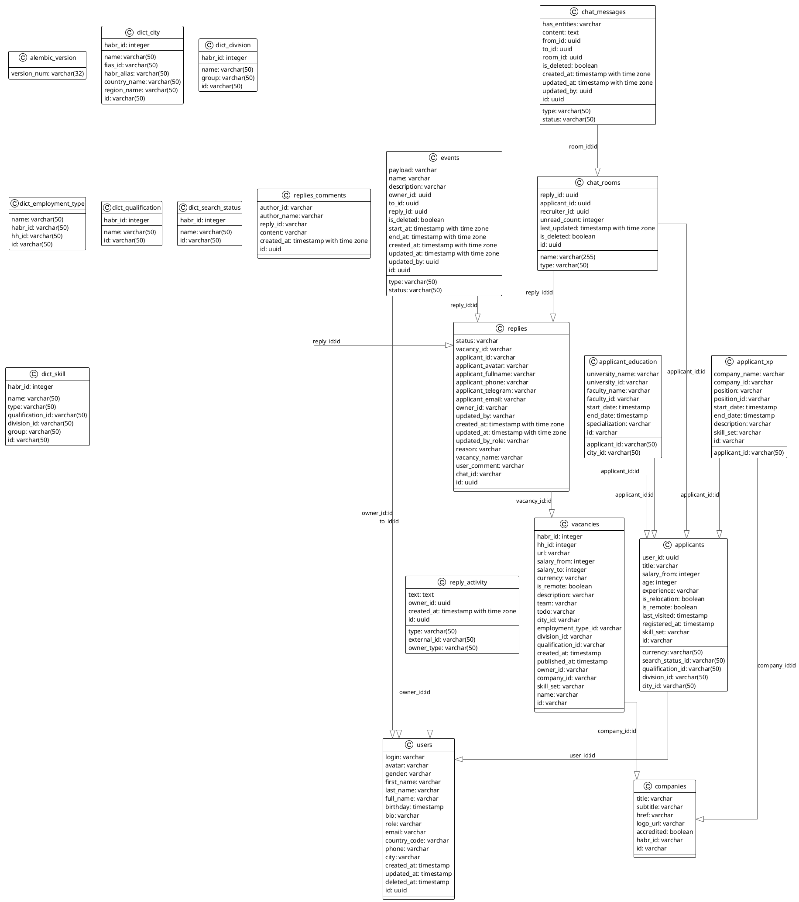

# Схема базы данных

## Схема

```plantuml
@startuml

!theme plain
top to bottom direction
skinparam linetype ortho

class alembic_version {
   version_num: varchar(32)
}
class applicant_education {
   applicant_id: varchar(50)
   university_name: varchar
   university_id: varchar
   faculty_name: varchar
   faculty_id: varchar
   city_id: varchar(50)
   start_date: timestamp
   end_date: timestamp
   specialization: varchar
   id: varchar
}
class applicant_xp {
   applicant_id: varchar(50)
   company_name: varchar
   company_id: varchar
   position: varchar
   position_id: varchar
   start_date: timestamp
   end_date: timestamp
   description: varchar
   skill_set: varchar
   id: varchar
}
class applicants {
   user_id: uuid
   title: varchar
   salary_from: integer
   currency: varchar(50)
   age: integer
   experience: varchar
   is_relocation: boolean
   is_remote: boolean
   last_visited: timestamp
   registered_at: timestamp
   search_status_id: varchar(50)
   qualification_id: varchar(50)
   division_id: varchar(50)
   city_id: varchar(50)
   skill_set: varchar
   id: varchar
}
class chat_messages {
   type: varchar(50)
   status: varchar(50)
   has_entities: varchar
   content: text
   from_id: uuid
   to_id: uuid
   room_id: uuid
   is_deleted: boolean
   created_at: timestamp with time zone
   updated_at: timestamp with time zone
   updated_by: uuid
   id: uuid
}
class chat_rooms {
   name: varchar(255)
   type: varchar(50)
   reply_id: uuid
   applicant_id: uuid
   recruiter_id: uuid
   unread_count: integer
   last_updated: timestamp with time zone
   is_deleted: boolean
   id: uuid
}
class companies {
   title: varchar
   subtitle: varchar
   href: varchar
   logo_url: varchar
   accredited: boolean
   habr_id: varchar
   id: varchar
}
class dict_city {
   name: varchar(50)
   fias_id: varchar(50)
   habr_id: integer
   habr_alias: varchar(50)
   country_name: varchar(50)
   region_name: varchar(50)
   id: varchar(50)
}
class dict_division {
   name: varchar(50)
   habr_id: integer
   group: varchar(50)
   id: varchar(50)
}
class dict_employment_type {
   name: varchar(50)
   habr_id: varchar(50)
   hh_id: varchar(50)
   id: varchar(50)
}
class dict_qualification {
   name: varchar(50)
   habr_id: integer
   id: varchar(50)
}
class dict_search_status {
   name: varchar(50)
   habr_id: integer
   id: varchar(50)
}
class dict_skill {
   name: varchar(50)
   type: varchar(50)
   qualification_id: varchar(50)
   division_id: varchar(50)
   habr_id: integer
   group: varchar(50)
   id: varchar(50)
}
class events {
   type: varchar(50)
   status: varchar(50)
   payload: varchar
   name: varchar
   description: varchar
   owner_id: uuid
   to_id: uuid
   reply_id: uuid
   is_deleted: boolean
   start_at: timestamp with time zone
   end_at: timestamp with time zone
   created_at: timestamp with time zone
   updated_at: timestamp with time zone
   updated_by: uuid
   id: uuid
}
class replies {
   status: varchar
   vacancy_id: varchar
   applicant_id: varchar
   applicant_avatar: varchar
   applicant_fullname: varchar
   applicant_phone: varchar
   applicant_telegram: varchar
   applicant_email: varchar
   owner_id: varchar
   updated_by: varchar
   created_at: timestamp with time zone
   updated_at: timestamp with time zone
   updated_by_role: varchar
   reason: varchar
   vacancy_name: varchar
   user_comment: varchar
   chat_id: varchar
   id: uuid
}
class replies_comments {
   author_id: varchar
   author_name: varchar
   reply_id: varchar
   content: varchar
   created_at: timestamp with time zone
   id: uuid
}
class reply_activity {
   type: varchar(50)
   text: text
   external_id: varchar(50)
   owner_id: uuid
   owner_type: varchar(50)
   created_at: timestamp with time zone
   id: uuid
}
class users {
   login: varchar
   avatar: varchar
   gender: varchar
   first_name: varchar
   last_name: varchar
   full_name: varchar
   birthday: timestamp
   bio: varchar
   role: varchar
   email: varchar
   country_code: varchar
   phone: varchar
   city: varchar
   created_at: timestamp
   updated_at: timestamp
   deleted_at: timestamp
   id: uuid
}
class vacancies {
   habr_id: integer
   hh_id: integer
   url: varchar
   salary_from: integer
   salary_to: integer
   currency: varchar
   is_remote: boolean
   description: varchar
   team: varchar
   todo: varchar
   city_id: varchar
   employment_type_id: varchar
   division_id: varchar
   qualification_id: varchar
   created_at: timestamp
   published_at: timestamp
   owner_id: varchar
   company_id: varchar
   skill_set: varchar
   name: varchar
   id: varchar
}

applicant_education   -[#595959,plain]-^  applicants           : "applicant_id:id"
applicant_xp          -[#595959,plain]-^  applicants           : "applicant_id:id"
applicant_xp          -[#595959,plain]-^  companies            : "company_id:id"
applicants            -[#595959,plain]-^  users                : "user_id:id"
chat_messages         -[#595959,plain]-^  chat_rooms           : "room_id:id"
chat_rooms            -[#595959,plain]-^  applicants           : "applicant_id:id"
chat_rooms            -[#595959,plain]-^  replies              : "reply_id:id"
events                -[#595959,plain]-^  replies              : "reply_id:id"
events                -[#595959,plain]-^  users                : "owner_id:id"
events                -[#595959,plain]-^  users                : "to_id:id"
replies               -[#595959,plain]-^  applicants           : "applicant_id:id"
replies               -[#595959,plain]-^  vacancies            : "vacancy_id:id"
replies_comments      -[#595959,plain]-^  replies              : "reply_id:id"
reply_activity        -[#595959,plain]-^  users                : "owner_id:id"
vacancies             -[#595959,plain]-^  companies            : "company_id:id"
@enduml
```